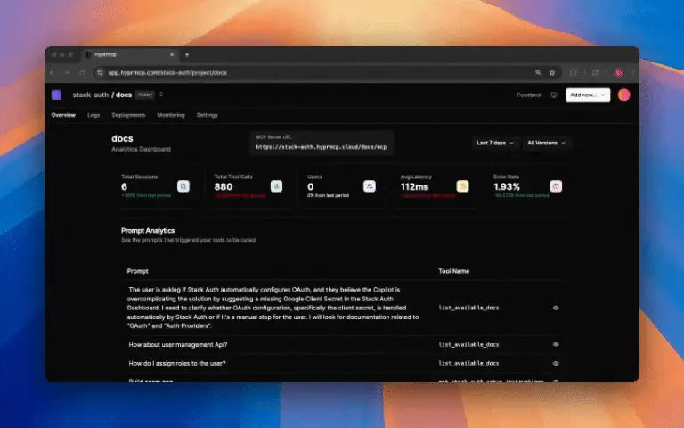
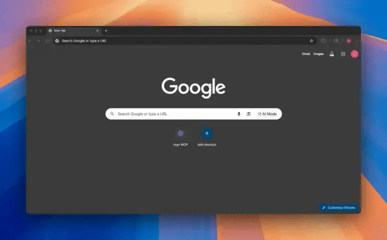
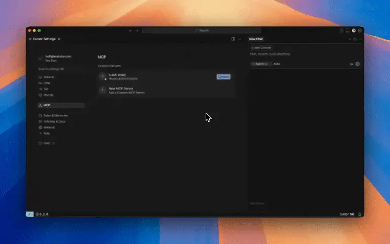
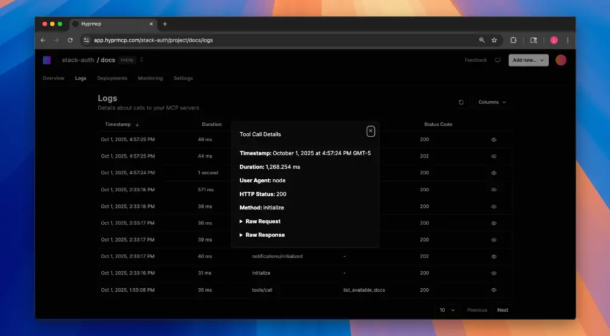
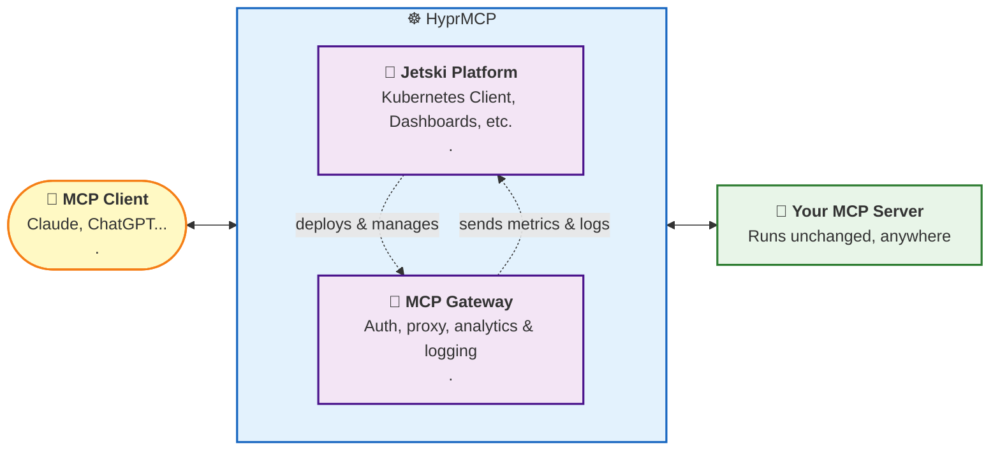

[](https://github.com/hyprmcp/jetski)
[](https://opensource.org/licenses/MIT)
[](https://hyprmcp.com/docs/getting-started/?utm_source=github)
[](CONTRIBUTING.md)
[](https://discord.gg/CgZ775fcsy)
[](https://github.com/hyprmcp/jetski/releases)
[](https://pkg.go.dev/github.com/hyprmcp/jetski)
[](https://goreportcard.com/report/github.com/hyprmcp/jetski)

<br>
<div align="center">
  <a href="https://hyprmcp.com?utm_source=github">
    
  </a>

<h3 align="center">🚤 MCP Analytics and Authentication Platform 🔐</h3>

  <p align="center">
    <a href="https://app.hyprmcp.com/?utm_source=github"><strong>Get started with HyprMCP Cloud »</strong></a>
    <br> <br>
    <a href="https://hyprmcp.com/?utm_source=github"><strong>Explore our website »</strong></a>
    <br> <br>
    <a href="https://hyprmcp.com/docs/"><strong>Read the docs »</strong></a>
    <br> <br>
    <a href="https://github.com/hyprmcp" target="_blank">GitHub</a>
    .
    <a href="https://www.linkedin.com/company/glasskube/" target="_blank">LinkedIn</a>
    .
     <a href="https://x.com/intent/follow?screen_name=glasskube" target="_blank">Twitter / X</a>
  </p>
</div>

<hr>

## 🚤 What is Jetski?

Jetski is an **Open Source MCP Analytics and Authentication Platform** - part of HyprMCP.
It solves the three biggest problems teams face when developing MCP servers with **zero code changes**:

1. **Installation & Setup**: Most users never make it past setup. They can't find client instructions or try to open your MCP URL in a browser and churn immediately.
2. **Authentication**: Identifying users and giving them the right tools and responses is still painful to implement.
3. **Logs, Analytics & Visibility**: No insight into how your MCP is used, which prompts trigger which tools, or why errors happen.

Our platform manages and deploys instances of our [`mcp-gateway`](https://github.com/hyprmcp/mcp-gateway)  that **sits in front of your MCP server** and handles the complexity.
It also collects and aggregates all analytics and metrics data captured by the gateway.

> [!IMPORTANT]
> Note that Jetski in under active development and is still in its infancy.
> The APIs and command-line interface may change in a backwards incompatible manner.

## 🗄️ Table Of Contents

- [What is Jetski?](https://github.com/hyprmcp/jetski#-what-is-jetski)
- [Features](https://github.com/hyprmcp/jetski#-features)
- [Quick Start](https://github.com/hyprmcp/jetski#-quick-start---get-started-in-minutes)
- [Demo Video](https://github.com/hyprmcp/jetski#-hyprmcp-demo-video)
- [HyprMCP Components](https://github.com/hyprmcp/jetski#-hyprmcp-components)
- [Architecture Diagram](https://github.com/hyprmcp/jetski#architecture-diagram)
- [Need Help?](https://github.com/hyprmcp/jetski#-need-help-or-want-to-provide-feedback)
- [Used Projects](https://github.com/hyprmcp/jetski#-used-projects)
- [How to Contribute](https://github.com/hyprmcp/jetski#-how-to-contribute-to-hyprmcp)
- [Contributors](https://github.com/hyprmcp/jetski#-thanks-to-all-our-contributors)
- [Activity](https://github.com/hyprmcp/jetski#-activity)
- [License](https://github.com/hyprmcp/jetski#-license)

## ✨ Features

|                                                                                                                                                                                                                                                         |                                                                                            |
|---------------------------------------------------------------------------------------------------------------------------------------------------------------------------------------------------------------------------------------------------------|--------------------------------------------------------------------------------------------|
| **Comprehensive Prompt Analytics** <br> See which prompts triggered which tools, from which clients, and what happened.<br>Gain complete visibility into your MCP server usage patterns and understand how users interact with your tools in real-time. |  |
| **Auto-Generated Setup Instructions** <br> Help users connect to the client effortlessly.<br>We automatically generate clear, step-by-step instructions for every supported MCP client, eliminating the #1 reason users churn during onboarding.        |    |
| **Zero-Code Authentication** <br> Identify and manage users securely without writing a single line of code.<br>Our proxy handles all authentication logic, allowing you to provide personalized tools and responses based on user identity.             |      |
| **Real-Time Debug Logs** <br> Instantly debug issues and understand server behavior in real-time.<br>See detailed logs of every request, response, and error, making it easy to identify and fix problems quickly.                                      |                    |

## 🚀 Quick Start - Get Started in Minutes

> [!TIP]
> Get started with our fully managed HyprMCP Cloud at [https://app.hyprmcp.com](https://app.hyprmcp.com/).

HyprMCP uses [mise](https://mise.jdx.dev/) to configure your development environment and execute development tasks.

### 1. Jetski Analytics Platform

**Clone the repository:**
  ```bash
  git clone https://github.com/hyprmcp/jetski.git
  cd jetski
  ```

**Install dependencies:**
  ```bash
  mise trust
  mise install
  pnpm i
  cp .dex.secret.env.example .dex.secret.env
  docker compose up -d
  ```

**Set host file entry:**
  ```bash
  echo -e "\n127.0.0.1    host.minikube.internal\n" | sudo tee -a /etc/hosts
  ```

**Start the platform:**

In Terminal 1, start the backend:
  ```bash
  mise run serve
  ```

In Terminal 2, start the frontend:
  ```bash
  pnpm run start
  ```

Generate demo data:
  ```bash
  mise run generate
  ```

Access the frontend at `http://localhost:4200` and log in with: `admin@example.com` / `password`

### 2. Jetski MCP Gateway Orchestration (Optional)

For Kubernetes orchestration, we recommend [Minikube](https://minikube.sigs.k8s.io/docs/) for local testing.

**Setup Kubernetes:**
  ```bash
  # Start Minikube
  mise run minikube-start

  # Deploy metacontroller (⚠️ operates against current kubectl context)
  mise run serve -- --install-controller
  ```

## 🎬 HyprMCP Demo Video

[](https://www.youtube.com/watch?v=m2-YyfjXap4)

## 🎯 HyprMCP Components

The HyprMCP platform is built on several open-source components that work together to provide a comprehensive MCP management solution:

### Core Components

- **[mcp-gateway](https://github.com/hyprmcp/mcp-gateway)** - MCP OAuth Proxy with dynamic client registration (DCR), MCP prompt analytics. This proxy sits in front of your MCP server.

- **[mcp-install-instructions-generator](https://github.com/hyprmcp/mcp-install-instructions-generator)** - Generate MCP Server Installation Instructions for Cursor, Visual Studio Code, Claude Code, and other MCP clients. Automatically creates user-friendly setup guides.

You can find all our components and contribute to them on [github.com/hyprmcp](https://github.com/hyprmcp).

## Architecture Diagram



**How it works:**
1. **MCP Client** (Claude Desktop, Cline, etc.) sends requests to HyprMCP instead of directly to your server
2. **HyprMCP Proxy** authenticates the user and validates permissions
3. **Request forwarding** to your unchanged MCP server
4. **Response handling** with automatic logging, analytics capture, and monitoring
5. **Real-time dashboard** provides visibility into all operations

## ☝️ Need Help or Want to Provide Feedback?

If you encounter any problems, we will be happy to support you wherever we can on our [Discord](https://discord.gg/CgZ775fcsy).
For bugs, issues or feature requests feel free to [open an issue](https://github.com/hyprmcp/jetski/issues/new/choose).
We are happy to assist you with anything related to the project.

## 📎 Used Projects

HyprMCP is built on top of many amazing open-source projects:

### Core Technologies
- **[Go](https://github.com/golang/go)** - Primary backend language for the platform
- **[Angular](https://github.com/angular/angular)** - Frontend framework for the dashboard UI
- **[Kubernetes](https://github.com/kubernetes/kubernetes)** - Container orchestration platform
- **[PostgreSQL](https://github.com/postgres/postgres)** - Primary database for storing analytics and metadata

### MCP & Authentication
- **[MCP Go SDK](https://github.com/modelcontextprotocol/go-sdk)** - Official Go SDK for Model Context Protocol
- **[Dex](https://github.com/dexidp/dex)** - OpenID Connect (OIDC) identity provider for authentication

### Kubernetes & Infrastructure
- **[Metacontroller](https://github.com/metacontroller/metacontroller)** - Lightweight Kubernetes controller framework

### UI & Design System
- **[Spartan](https://github.com/spartan-ng/spartan)** - Collection of UI components for Angular

## 🤝 How to Contribute to HyprMCP

Your feedback is invaluable to us as we continue to improve HyprMCP and Jetski. If you'd like to contribute, consider trying out the platform, reporting any issues, and sharing your suggestions. See [the contributing guide](CONTRIBUTING.md) for detailed instructions on how you can contribute.

Whether you want to:
- Report bugs or request features
- Contribute code improvements
- Improve documentation
- Share your MCP server use cases
- Help other users in the community

We welcome all contributions!

## 👾 Activity


## 📘 License

Jetski is licensed under the MIT license. For more information check the [LICENSE](https://github.com/hyprmcp/jetski/blob/main/LICENSE) file for details.
